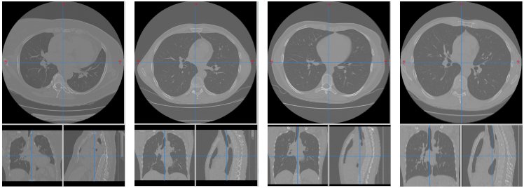
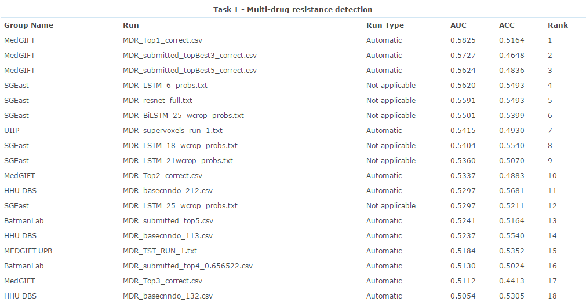

# Tuberculosis_multi-durg_resistance_detection
This repository contains code for tuberculosis multi-durg resistance detection based on the analysis of chest CT scan. We train our model via python code, because the part is very similar with HEp-2 cell classification so please refer to that repository. And this repo is referred to matlab code for the classification part and mask part.

The total number of samples in ImageCLEF dataset is 230, including 134 samples of tuberculosis drug sensitivity (DS), and 96 samples belonging to multi drug resistance (MDR). For this small dataset, we refer to [this post](https://blog.keras.io/building-powerful-image-classification-models-using-very-little-data.html), and it is a very useful link for deep learning researchers, which teaches you how to train your model using very little data.

The following figure is from ImageCLEF dataset.

Our best result is 64%. Unfortunately, we did not take part in the competition. The final results have been submitted to ImageCLEF as follows.

If you have 

此工作的主要贡献者：高龙、陆梦驰、赵凯凯
